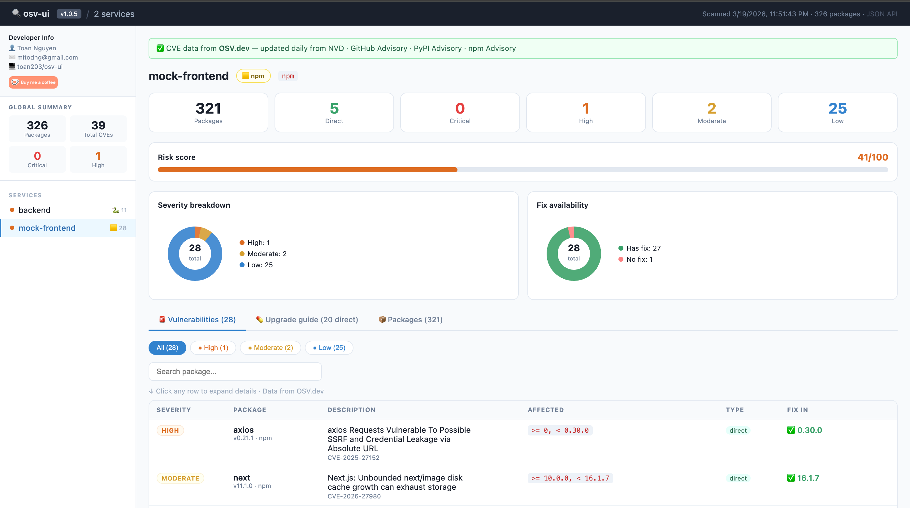

<div align="center">



# osv-ui

**A beautiful, zero-config CVE dashboard for npm and Python projects.**  
One command. No signup. No API key. Opens in your browser instantly.

[](https://www.npmjs.com/package/osv-ui)
[](https://www.npmjs.com/package/osv-ui)
[](LICENSE)
[](CONTRIBUTING.md)
[](https://nodejs.org)

</div>

[[🇻🇳 Tiếng Việt](README.vi.md) · [🇺🇸 English](README.md) · [🇨🇳 中文](README.zh.md) · [🇯🇵 日本語](README.ja.md)]

[](https://ko-fi.com/P5P31W9W6A)

---

## The problem

```bash
$ npm audit

# ... 300 lines of this ...
# moderate  Regular Expression Denial of Service in semver
# package   semver
# patched in >=7.5.2
# ...
# 12 vulnerabilities (3 moderate, 6 high, 3 critical)
```

Nobody reads that. Security gets ignored. Dependencies stay vulnerable.

## The solution

```bash
npx osv-ui
```

→ Opens a dashboard. Every CVE, every fix, all your services. Done.

### Why give it a try?

- **Zero-config**: No complex setup, no signup, no API key required.
- **Privacy & Security**: Runs 100% locally. It **never** sends your project's source code to OSV.dev (Google) for matching.
- **Fast & Visual**: Real-time Risk Scores, vulnerability charts, and clear upgrade guides in seconds.
- **Multi-platform**: Built-in support for both Node.js (npm) and Python ecosystems.

---

## Features

| | |
|---|---|
| 🟨 **npm** + 🐍 **Python** | Scans `package-lock.json`, `requirements.txt`, `Pipfile.lock`, `poetry.lock`, `pyproject.toml` |
| 📡 **Live CVE data** | Powered by [OSV.dev](https://osv.dev) — updated daily from NVD, GitHub Advisory, PyPI Advisory. **No API key.** |
| 🏢 **Multi-service** | Scan your entire monorepo in one command — frontend, backend, workers, ML services |
| 💊 **Fix guide** | Dependabot-style upgrade table: current version → safe version + one-click copy command |
| 🎯 **Risk score** | 0–100 per service so you know where to focus first |
| 🔍 **CVE drill-down** | Click any row — CVSS score, description, NVD link, GitHub Advisory link |
| 🔌 **JSON API** | `GET /api/data` — pipe into your own CI scripts or reporting tools |

---

## Quick start

**Scan current directory:**
```bash
npx osv-ui
```

**Scan a monorepo (multiple services at once):**
```bash
npx osv-ui ./frontend ./api ./worker ./ml-service
```

**Auto-discover all services under the current directory:**
```bash
npx osv-ui --discover
```

**Add to your `package.json` scripts:**
```json
{
  "scripts": {
    "audit:ui":  "npx osv-ui",
    "audit:all": "npx osv-ui ./frontend ./api ./worker"
  }
}
```

**All options:**
```
--discover      Auto-find service dirs that contain a supported manifest
--port=2003     Use a custom port (default: 2003)
--no-open       Don't auto-open the browser
--offline       Skip OSV.dev lookup — parse manifests only
```

---

## Supported manifest files

| Ecosystem | Files |
|-----------|-------|
| **npm** | `package-lock.json` (lockfileVersion 1, 2, 3) |
| **Python** | `requirements.txt` · `Pipfile.lock` · `poetry.lock` · `pyproject.toml` |

More ecosystems coming — see [Roadmap](#roadmap).

---

## How it works

```
Your project files
    │
    ├─ package-lock.json   ──┐
    ├─ requirements.txt    ──┤──► parser ──► package list
    └─ Pipfile.lock        ──┘
                                    │
                                    ▼
                             OSV.dev batch API  (free, no key)
                                    │
                                    ▼
                             CVE matches + fix versions
                                    │
                                    ▼
                         Express server → browser dashboard
                              http://localhost:2003
```

CVE data comes from **[OSV.dev](https://osv.dev)** — a free, open database maintained by Google that aggregates:
- 🇺🇸 [NVD](https://nvd.nist.gov) — NIST National Vulnerability Database
- 🐙 [GitHub Advisory Database](https://github.com/advisories) (GHSA)
- 🐍 [PyPI Advisory Database](https://github.com/pypa/advisory-database)
- 📦 npm Advisory Database
- 🦀 RustSec · Go Vuln DB · OSS-Fuzz · and more

Updated **daily**. No account. No rate limit. No vendor lock-in.

---

## vs alternatives

| | **osv-ui** | `npm audit` | Snyk | Dependabot |
|---|:---:|:---:|:---:|:---:|
| Visual dashboard | ✅ | ❌ terminal only | ✅ | ✅ |
| npm support | ✅ | ✅ | ✅ | ✅ |
| Python support | ✅ | ❌ | ✅ | ✅ |
| Multi-service in one view | ✅ | ❌ | ✅ paid | ✅ |
| No signup required | ✅ | ✅ | ❌ | ❌ |
| Works on **GitLab Free** | ✅ | ✅ | ❌ | ❌ |
| Self-hosted / local | ✅ | ✅ | ❌ | ❌ |
| Fix commands | ✅ | partial | ✅ | ✅ |
| Open source | ✅ | ✅ | ❌ | ❌ |

---

## GitLab CI — block deploys on critical CVEs

No Dependabot on GitLab Free? Add this to `.gitlab-ci.yml`:

```yaml
audit:
  stage: test
  image: node:20-alpine
  script:
    - npm audit --json > /tmp/audit.json || true
    - |
      node -e "
        const r = require('/tmp/audit.json');
        const crit = Object.values(r.vulnerabilities || {})
          .filter(v => v.severity === 'critical').length;
        if (crit > 0) {
          console.error('BLOCKED: ' + crit + ' critical CVE(s). Run: npx osv-ui');
          process.exit(1);
        }
        console.log('OK: no critical vulnerabilities');
      "
  artifacts:
    paths: [/tmp/audit.json]
    when: always
```

---

## Requirements

- **Node.js** >= 16
- Internet access for OSV.dev queries — or use `--offline`
- npm projects: run `npm install` first so `package-lock.json` exists
- Python projects: any of the supported manifest files listed above

---

## Roadmap

All contributions are welcome. If you want to work on something, open an issue first so we can coordinate.

- [ ] **Go support** — parse `go.sum` / `go.mod`
- [ ] **Rust support** — parse `Cargo.lock`
- [ ] **Java / Maven** — parse `pom.xml`
- [ ] **Export report** — save as HTML / PDF / JSON
- [ ] **GitHub Actions** — post a CVE diff comment on PRs
- [ ] **SBOM export** — CycloneDX / SPDX format (for Dependency-Track)
- [ ] **Watch mode** — re-scan on manifest file changes
- [ ] **History / trend** — track CVE count per branch over time
- [ ] **Slack / webhook** — notify on new critical CVEs
- [ ] **Dark mode** — for the dashboard UI

---

## Contributing

This project is built by the community. All skill levels welcome.

**Good first issues** (no deep knowledge required):
- Add Go or Rust manifest parser (follow the pattern in `src/parsers.js`)
- Improve Python parser edge cases
- Add dark mode to the dashboard CSS
- Write unit tests for the parsers

```bash
# Clone and run locally
git clone https://github.com/toan203/osv-ui
cd osv-ui
npm install

# Run against your own project
node bin/cli.js /path/to/your/project

# Run against multiple services
node bin/cli.js ./frontend ./backend
```

Please read [CONTRIBUTING.md](CONTRIBUTING.md) for code style and PR process.

---

## License

[MIT](LICENSE) — use it, fork it, embed it, build on it. Attribution appreciated but not required.

---

<div align="center">

Did osv-ui catch a real CVE in your project?  
A ⭐ helps other developers find this tool.

**[Share on Twitter](https://twitter.com/intent/tweet?text=Just%20found%20osv-ui%20%E2%80%94%20a%20beautiful%20one-command%20CVE%20dashboard%20for%20npm%20%26%20Python.%20Free%2C%20no%20signup%3A%20npx%20osv-ui%20%F0%9F%94%A5&url=https://github.com/toan203/osv-ui)** · **[Post on Reddit](https://reddit.com/submit?url=https://github.com/toan203/osv-ui&title=osv-ui%20%E2%80%94%20visual%20CVE%20dashboard%20for%20npm%20%26%20Python%2C%20one%20command%2C%20no%20signup)**

</div>
